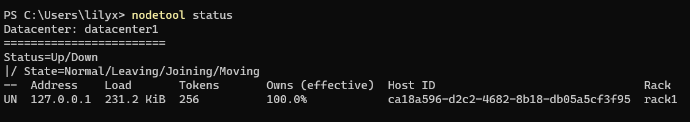
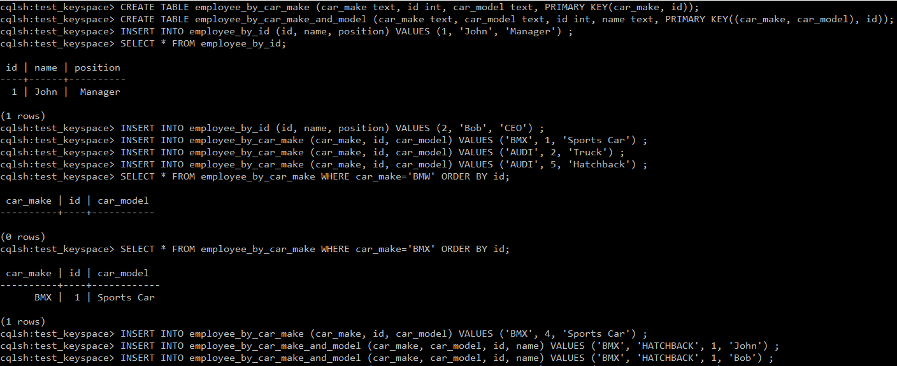
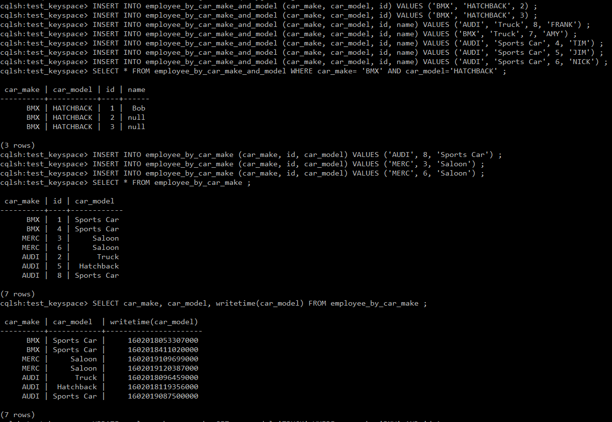
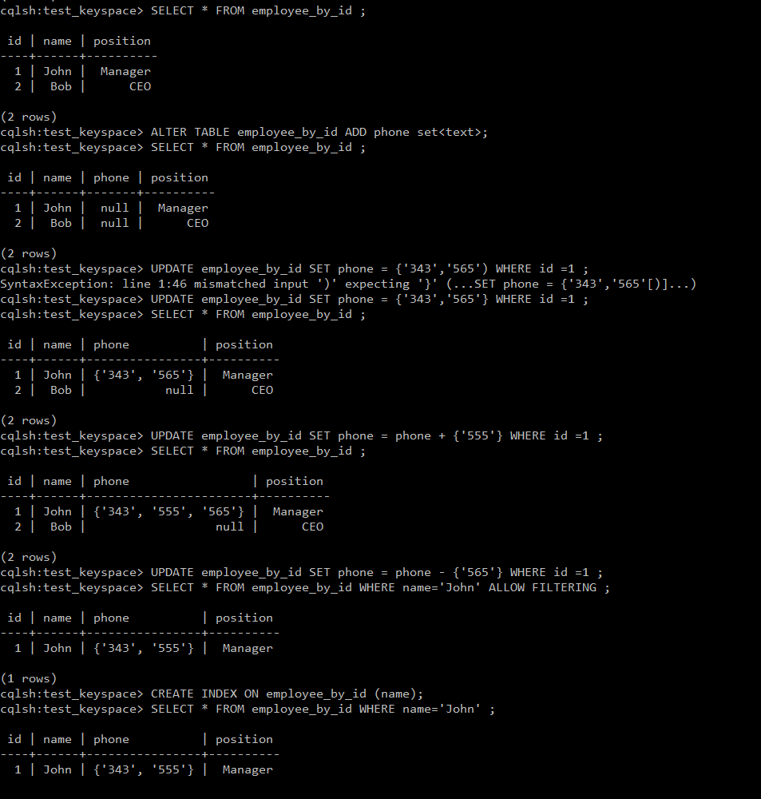
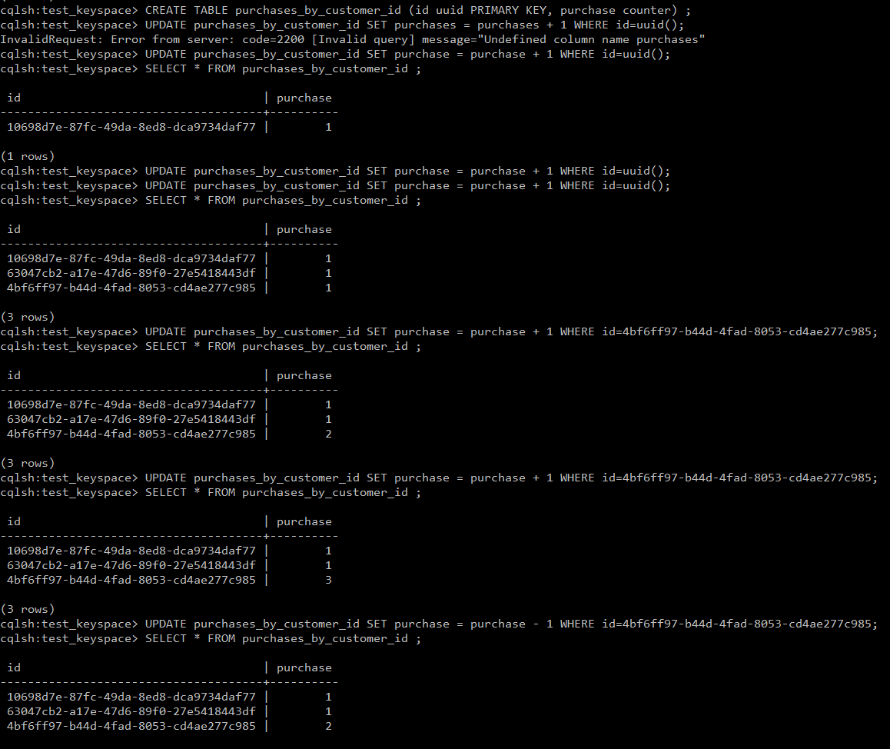
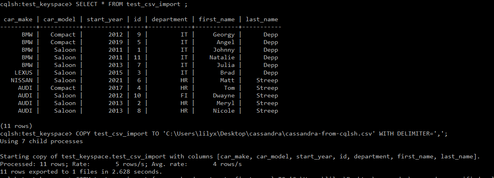
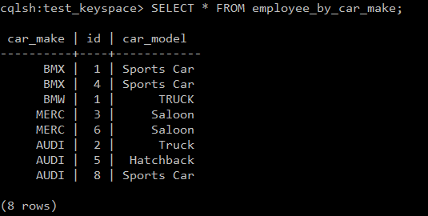
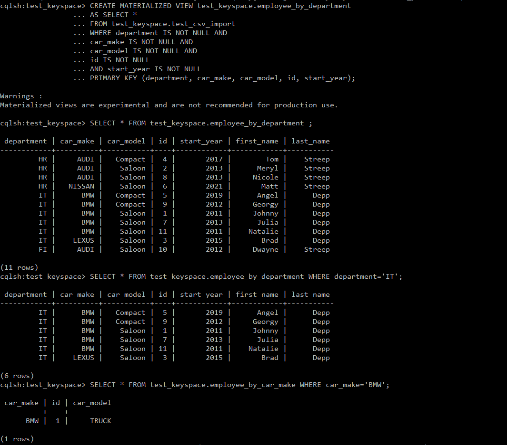
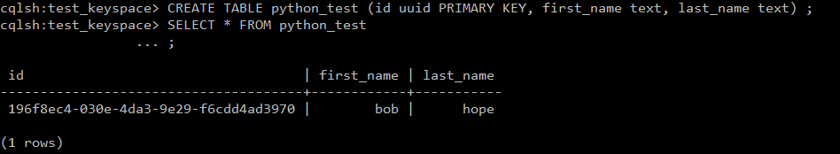

#### When Following [This Video](https://www.youtube.com/watch?v=EEXtVn3zAqc&ab_channel=jumpstartCS)
Install Javas 8U251 instead of the latest 8U261

#### When There are Multiple Versions of Python and cqlsh to Execute with Python 2
- Prereq: Download Python 2.7
1. Rename C:/Python27/python.exe to C:/Python27/python2.exe
2. Run `python2 -m cqlsh` in C:/Program Files/apache-cassandra-3.11.8/bin

<a href="https://www.youtube.com/watch?v=EEXtVn3zAqc"></a>

#### CREATE KEYSPACE

In Cassandra Shell Running cqlsh:
`CREATE KEYSPACE test_keyspace WITH replication = {'class':'SimpleStrategy','replication_factor':'1'} AND durable_writes = 'true';`
- specify name of keyspace
- specify settings - set replication factor for # nodes to replicate in cluster, ie copied 3 times would be 3
- specify replication class - a one-node cluster is 'SimpleStrategy'
- set if we want durable writes - default to true, false increases speed of writes and also increases data loss.

<a href="https://www.youtube.com/watch?v=91ZwkO07xHU"></a>

##### Outermost container for data, a cluster may contain many key spaces
- a keyspace can have many tables
- a table contains a set of rows of key-value-pair columns
- after the tables, we deal with wide rows consisting of a primary key and a large # of columns
- every row has a primary key specified with data access
- primary key = composite key - made of the partition key, which decides on which nodes our data will be stored and # of clustering columns for sorting data and order stored on disk.

```
CREATE KEYSPACE test_keyspace WITH replication = {'class':'SimpleStrategy','replication_factor':'1'} AND durable_writes = 'true';
```

#### Check Keyspaces
`DESCRIBE KEYSPACES`

#### Use Keyspace
```
USE test_keyspace ;
```


#### CREATE TABLE

```
CREATE TABLE employee_by_id (id int PRIMARY KEY, name text, position text);
```

```
CREATE TABLE employee_by_car_make (car_make text, id int, car_model text, PRIMARY KEY(car_make, id));
```
```
CREATE TABLE employee_by_car_make_sorted (car_make text, age int, id int, name text, PRIMARY KEY(car_make, age, id));
```
```
CREATE TABLE employee_by_car_make_and_model (car_make text, car_model text, id int, name text, PRIMARY KEY((car_make, car_model), id));
```
```
INSERT INTO employee_by_id (id, name, position) VALUES (1, 'John', 'Manager') ;
```
```
DROP TABLE employee_bar_car_make ;
```
```
DESCRIBE TABLES;
```


<a href="https://www.youtube.com/watch?v=QA-owFLFNcQ"></a>

<a href="https://www.youtube.com/watch?v=QA-owFLFNcQ"></a>

#### Insert Data into Table
```
INSERT INTO employee_by_id (id, name, position) VALUES (2, 'Bob', 'CEO') ;
INSERT INTO employee_by_car_make (car_make, id, car_model) VALUES ('BMW', 1, 'Sports Car') ;
INSERT INTO employee_by_car_make (car_make, id, car_model) VALUES ('AUDI', 2, 'Truck') ;
INSERT INTO employee_by_car_make (car_make, id, car_model) VALUES ('AUDI', 5, 'Hatchback') ;
INSERT INTO employee_by_car_make (car_make, id, car_model) VALUES ('BMW', 4, 'Sports Car') ;
```

#### Select from Table
```
SELECT * FROM employee_by_car_make WHERE car_make='BMW' ORDER BY id;
```
 car_make | id | car_model
----------+----+------------
      BMX |  1 | Sports Car


#### Insert Data into Table
```
INSERT INTO employee_by_car_make_and_model (car_make, car_model, id, name) VALUES ('BMW','HATCHBACK', 1, 'John') ;
INSERT INTO employee_by_car_make_and_model (car_make, car_model, id, name) VALUES ('AUDI', 'Truck', 8, 'FRANK') ;
INSERT INTO employee_by_car_make_and_model (car_make, car_model, id, name) VALUES ('BMX', 'Truck', 7, 'AMY') ;
INSERT INTO employee_by_car_make_and_model (car_make, car_model, id, name) VALUES ('AUDI', 'Sports Car', 4, 'TIM') ;
INSERT INTO employee_by_car_make_and_model (car_make, car_model, id, name) VALUES ('AUDI', 'Sports Car', 5, 'JIM') ;
INSERT INTO employee_by_car_make_and_model (car_make, car_model, id, name) VALUES ('AUDI', 'Sports Car', 6, 'NICK') ;
```

#### Insert Data into Table
```
INSERT INTO employee_by_car_make (car_make, id, car_model) VALUES ('AUDI', 8, 'Sports Car') ;
INSERT INTO employee_by_car_make (car_make, id, car_model) VALUES ('MERC', 3, 'Saloon') ;
INSERT INTO employee_by_car_make (car_make, id, car_model) VALUES ('MERC', 6, 'Saloon') ;
```


#### This Will Mean name Header value will be Null
```
INSERT INTO employee_by_car_make_and_model (car_make, car_model, id) VALUES ('BMW', 'HATCHBACK', 3) ;
```

#### Select Filter
```
SELECT * FROM employee_by_car_make_and_model WHERE car_make= 'BMW' AND car_model='HATCHBACK' ;
```
 car_make | car_model | id | name
----------+-----------+----+------
      BMW | HATCHBACK |  1 |  Bob
      BMW | HATCHBACK |  2 | null
      BMW | HATCHBACK |  3 | null

```
SELECT * FROM employee_by_car_make ;
```
 car_make | id | car_model
----------+----+------------
      BMX |  1 | Sports Car
      BMX |  4 | Sports Car
     MERC |  3 |     Saloon
     MERC |  6 |     Saloon
     AUDI |  2 |      Truck
     AUDI |  5 |  Hatchback
     AUDI |  8 | Sports Car

#### Writetime - Find Out When Item Inserted into Table
```
SELECT car_make, car_model, writetime(car_model) FROM employee_by_car_make ;
```
 car_make | car_model  | writetime(car_model)
----------+------------+----------------------
      BMX | Sports Car |     1602018053307000
      BMX | Sports Car |     1602018411020000
     MERC |     Saloon |     1602019109699000
     MERC |     Saloon |     1602019120387000
     AUDI |      Truck |     1602018096459000
     AUDI |  Hatchback |     1602018119356000
     AUDI | Sports Car |     1602019087500000

<a href="https://www.youtube.com/watch?v=QA-owFLFNcQ"></a>

#### Change or Update Value from Table
```
UPDATE employee_by_car_make USING TTL 60 SET car_model='TRUCK' WHERE car_make='BMW' AND id=2 ;
```

#### Add a Column
```
SELECT * FROM employee_by_id ;
```
 id | name | position
----+------+----------
  1 | John |  Manager
  2 |  Bob |      CEO
```
ALTER TABLE employee_by_id ADD phone set<text>;
```
```
SELECT * FROM employee_by_id ;
```
 id | name | phone | position
----+------+-------+----------
  1 | John |  null |  Manager
  2 |  Bob |  null |      CEO


#### Updating Altering Existing Values in Table Using Variables
```
UPDATE employee_by_id SET phone = {'343','565'} WHERE id =1 ;
```
```
SELECT * FROM employee_by_id ;
```
 id | name | phone          | position
----+------+----------------+----------
  1 | John | {'343', '565'} |  Manager
  2 |  Bob |           null |      CEO

#### Adding Variables
```
UPDATE employee_by_id SET phone = phone + {'555'} WHERE id =1 ;
```
```
SELECT * FROM employee_by_id ;
```
 id | name | phone                 | position
----+------+-----------------------+----------
  1 | John | {'343', '555', '565'} |  Manager
  2 |  Bob |                  null |      CEO

#### Subtracting Variables
```
UPDATE employee_by_id SET phone = phone - {'565'} WHERE id =1 ;
```
#### ORDER BY is Only Supported on the Clustered Columns of Primary Key
#### ALLOW FILTERING Bypasses this but this may be unperformant as data may be access through a large # of tables in multiple cluster
```
SELECT * FROM employee_by_id WHERE name='John' ALLOW FILTERING ;
```
 id | name | phone          | position
----+------+----------------+----------
  1 | John | {'343', '555'} |  Manager

#### Create Index
```
CREATE INDEX ON employee_by_id (name);
```
```
SELECT * FROM employee_by_id WHERE name='John' ;
```
 id | name | phone          | position
----+------+----------------+----------
  1 | John | {'343', '555'} |  Manager


#### Create Table with Uuid Type
```
CREATE TABLE employee_by_uuid (id uuid PRIMARY KEY, first_name text, last_name text) ;
```
#### Insert to Autogenerate Uuid
```
INSERT INTO employee_by_uuid (id, first_name, last_name) VALUES (uuid(), 'tom', 'dunne');
INSERT INTO employee_by_uuid (id, first_name, last_name) VALUES (uuid(), 'som', 'dunne');
INSERT INTO employee_by_uuid (id, first_name, last_name) VALUES (uuid(), 'tim', 'smith');
INSERT INTO employee_by_uuid (id, first_name, last_name) VALUES (uuid(), 'bob', 'hanson');
```
```
SELECT * FROM employee_by_uuid
```
 id                                   | first_name | last_name
--------------------------------------+------------+-----------
 e5ee566e-9963-4682-b181-95e701f1f7c8 |        bob |    hanson
 daf6b263-cc61-4881-9919-b9b121ed912b |        tom |     dunne
 2f51f0d1-e72d-45cd-b349-78f6f1f3e042 |        tim |     smith
 87ea1615-adea-404f-9841-c8bef20b78b0 |        tom |     dunne

#### Timeuuid
```
CREATE TABLE employee_by_timeuuid (id timeuuid PRIMARY KEY, first_name text, last_name text);
```

#### Insert
```
INSERT INTO employee_by_timeuuid (id, first_name, last_name) VALUES (now(), 'tim', 'jones') ;
INSERT INTO employee_by_timeuuid (id, first_name, last_name) VALUES (now(), 'ally', 'smith') ;
INSERT INTO employee_by_timeuuid (id, first_name, last_name) VALUES (now(), 'kate', 'smith') ;
```

<a href="https://www.youtube.com/watch?v=2YxV1Ia0evc"></a>

#### Working with Counters
```
CREATE TABLE purchases_by_customer_id (id uuid PRIMARY KEY, purchase counter) ;
```

#### Update
```
UPDATE purchases_by_customer_id SET purchase = purchase + 1 WHERE id=uuid();
UPDATE purchases_by_customer_id SET purchase = purchase + 1 WHERE id=uuid();
UPDATE purchases_by_customer_id SET purchase = purchase + 1 WHERE id=uuid();
```
```
SELECT * FROM purchases_by_customer_id ;
```
 id                                   | purchase
--------------------------------------+----------
 10698d7e-87fc-49da-8ed8-dca9734daf77 |        1
 63047cb2-a17e-47d6-89f0-27e5418443df |        1
 4bf6ff97-b44d-4fad-8053-cd4ae277c985 |        1

#### Add 1 to Counter via Update
```
UPDATE purchases_by_customer_id SET purchase = purchase + 1 WHERE id=4bf6ff97-b44d-4fad-8053-cd4ae277c985;
```
```
SELECT * FROM purchases_by_customer_id ;
```
 id                                   | purchase
--------------------------------------+----------
 10698d7e-87fc-49da-8ed8-dca9734daf77 |        1
 63047cb2-a17e-47d6-89f0-27e5418443df |        1
 4bf6ff97-b44d-4fad-8053-cd4ae277c985 |        2

<a href="https://www.youtube.com/watch?v=N71NwCKfyQ4"></a>
<a href="https://www.youtube.com/watch?v=N71NwCKfyQ4"></a>

#### Create Empy Table
```
CREATE TABLE test_csv_import (car_make text, car_model text, start_year int, id int, first_name text, last_name text, department text, PRIMARY KEY(car_make, car_model, start_year, id));
```

#### Upload Existing .csv File
```
COPY test_csv_import (car_make, car_model, start_year, id, first_name, last_name, department) FROM 'C:\Users\lilyx\Desktop\cassandra\cassandra.csv' WITH DELIMITER=',' AND HEADER=TRUE;
```
```
SELECT * FROM test_csv_import ;
```
 car_make | car_model | start_year | id | department | first_name | last_name
----------+-----------+------------+----+------------+------------+-----------
      BMW |   Compact |       2012 |  9 |         IT |     Georgy |      Depp
      BMW |   Compact |       2019 |  5 |         IT |      Angel |      Depp
      BMW |    Saloon |       2011 |  1 |         IT |     Johnny |      Depp
      BMW |    Saloon |       2011 | 11 |         IT |    Natalie |      Depp
      BMW |    Saloon |       2013 |  7 |         IT |      Julia |      Depp
    LEXUS |    Saloon |       2015 |  3 |         IT |       Brad |      Depp
   NISSAN |    Saloon |       2021 |  6 |         HR |       Matt |    Streep
     AUDI |   Compact |       2017 |  4 |         HR |        Tom |    Streep
     AUDI |    Saloon |       2012 | 10 |         FI |     Dwayne |    Streep
     AUDI |    Saloon |       2013 |  2 |         HR |      Meryl |    Streep
     AUDI |    Saloon |       2013 |  8 |         HR |     Nicole |    Streep

#### Save Out Entire Table as a .csv to the Local Directory
```
COPY test_csv_import TO 'C:\Users\lilyx\Desktop\cassandra\cassandra-from-cqlsh.csv' WITH DELIMITER=',';
```

#### Save Out Specific Headers
```
COPY test_csv_import (car_mark, department, first_name) TO 'C:\Users\lilyx\Desktop\cassandra\cassandra-specified-columns.csv' WITH DELIMITER=',';
```


```
SELECT * FROM test_keyspace.employee_by_department ;
```

 department | car_make | car_model | id | start_year | first_name | last_name
------------+----------+-----------+----+------------+------------+-----------
         HR |     AUDI |   Compact |  4 |       2017 |        Tom |    Streep
         HR |     AUDI |    Saloon |  2 |       2013 |      Meryl |    Streep
         HR |     AUDI |    Saloon |  8 |       2013 |     Nicole |    Streep
         HR |   NISSAN |    Saloon |  6 |       2021 |       Matt |    Streep
         IT |      BMW |   Compact |  5 |       2019 |      Angel |      Depp
         IT |      BMW |   Compact |  9 |       2012 |     Georgy |      Depp
         IT |      BMW |    Saloon |  1 |       2011 |     Johnny |      Depp
         IT |      BMW |    Saloon |  7 |       2013 |      Julia |      Depp
         IT |      BMW |    Saloon | 11 |       2011 |    Natalie |      Depp
         IT |    LEXUS |    Saloon |  3 |       2015 |       Brad |      Depp
         FI |     AUDI |    Saloon | 10 |       2012 |     Dwayne |    Streep

<a href="https://www.youtube.com/watch?v=XhNIU7X_HUU"></a>
<a href="https://www.youtube.com/watch?v=XhNIU7X_HUU"></a>

#### Set Materialized Views

```
CREATE MATERIALIZED VIEW test_keyspace.employee_by_department
                 ... AS SELECT *
                 ... FROM test_keyspace.test_csv_import
                 ... WHERE department IS NOT NULL AND
                 ... car_make IS NOT NULL AND
                 ... car_model IS NOT NULL AND
                 ... id IS NOT NULL
                 ... AND start_year IS NOT NULL
                 ... PRIMARY KEY (department, car_make, car_model, id, start_year);
```

#### Test Our Materialized Views
```
SELECT * FROM test_keyspace.employee_by_department WHERE department='IT';
```

 department | car_make | car_model | id | start_year | first_name | last_name
------------+----------+-----------+----+------------+------------+-----------
         IT |      BMW |   Compact |  5 |       2019 |      Angel |      Depp
         IT |      BMW |   Compact |  9 |       2012 |     Georgy |      Depp
         IT |      BMW |    Saloon |  1 |       2011 |     Johnny |      Depp
         IT |      BMW |    Saloon |  7 |       2013 |      Julia |      Depp
         IT |      BMW |    Saloon | 11 |       2011 |    Natalie |      Depp
         IT |    LEXUS |    Saloon |  3 |       2015 |       Brad |      Depp

```
SELECT * FROM test_keyspace.employee_by_car_make WHERE car_make='BMW';
```
 car_make | id | car_model
----------+----+-----------
      BMW |  1 |     TRUCK

<a href="https://www.youtube.com/watch?v=NKsRYoLhSJU"></a>

#### Create Table
```
CREATE TABLE python_test (id uuid PRIMARY KEY, first_name text, last_name text) ;
```

Run cassandratest.py

```
SELECT * FROM python_test;
```
 id                                   | first_name | last_name
--------------------------------------+------------+-----------
 196f8ec4-030e-4da3-9e29-f6cdd4ad3970 |        bob |      hope